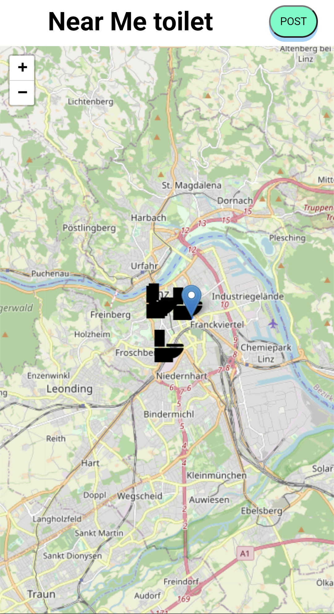
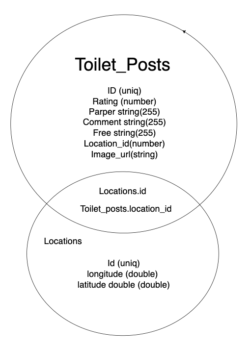

# Near-Me-Toilet🚽🚻
## What is Near-Me-Toilet
"Near-me-toilet" is one of the application that can show you toilet or restrooms near you. User can post a toilet that they found somewhere.

## What I want to solve with this app
The reason why I created this app is because in countries other than Japan, toilets are charged and it is very difficult to find a toilet in an unknown place.




# Directory Structure
```js
- client 
    -- public
    -- src 
      -- components
      -- img
      -- pages
    -- utils
- db
    -- migration
    -- seed
- server
    -- model
    -- router
```

# Quick Installation and Set up
Follow this down below. This application uses cloudinary.
https://cloudinary.com/
```js
// install modules and dependencies for express 
$npm install 

// install modules and dependencies for client 
$cd client
$npm install

// setting up .env file. this down below is example
$touch .env

// after making .env file If you are not familiar with the command, you can make and edit .env file instead of using commands.
$vi .env 
// Please make sure that how to set up env file. there is .env example

// after setting up .env file , you can set up inside of seed file and run migration and seed files
$npm run migration
$npm run seed

```

# Backend

## database schema 
Toilet_posts table has a foreign key reference between location table's id



## API
Those down below is all endpoints in this app.
```js

// this end point fetch all toilet posts
router.get("/", async (req, res) => {

});

// you can post locations and a post
router.post("/", async (req, res) => {
// 
});

// toilet image is going to be saved to cloudinary via this endpoint
router.post("/uploadImage", upload.single('image'), async (req, res) => {
  
});

module.exports = router;

```

# Front end
"/pages" has two Home and Post pages files. 

"/components" is for reuse components

## Resources
[React Router Docs](https://reactrouter.com/en/main)

[Leaflet](https://leafletjs.com/)

[leaflet React](https://react-leaflet.js.org/)

[Cloudinary](https://cloudinary.com/)

[Express](https://expressjs.com/)

[Knex](https://knexjs.org/)